callcenter-simulator
======

A sample callcenter simulator using OpenAI technologies such as ChatGPT, Whisper and other APIs to automate and improve callcenter operation. This project is intended to be a sandbox application to test feasibility and other ideas.

---

OpenAIの技術、ChatGPT、WhisperなどのAPIを使用して、コールセンターのオペレーションを自動化および改善するためのサンプルコールセンターシミュレーターを作成しました。このプロジェクトは、実現可能性やその他のアイデアをテストするためのサンドボックスアプリケーションとして構想されています。


# Motivation

The goal of this project is to test the idea of using AI in callcenter operation and if current existing AI products can already replace human agents.

---

このプロジェクトの目的は、AIをコールセンターのオペレーションに使用するアイデアをテストし、既存のAI製品がすでに人間のエージェントを置き換えることができるかどうかを確認することです。


# Application

The application supports Japanese language settings. (日本語対応)

For chat messaging, you can always use Japanese or any languages. However, for voice call, you need to set the language setting before using Japanese because I need to set the voice in Speech Synthesis API.

[2023-06-14 Update: Use function calling](#function-calling)

## How to Use Customer Support


### **Select Type of Inquiry**
  
Normally, you want to find out what the user wants from the beginning.
You can then use this to customize the initial message and the prompt.

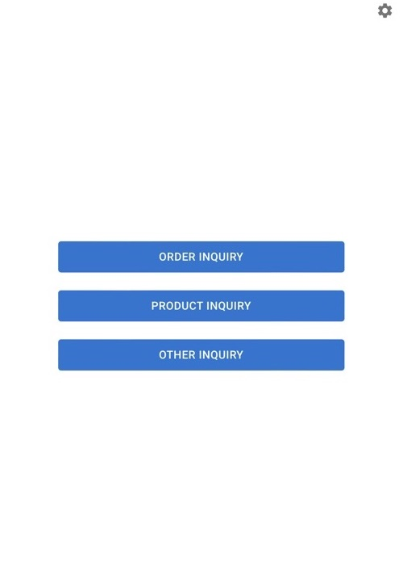


### **Select Mode**

Select Voice Call or Chat support

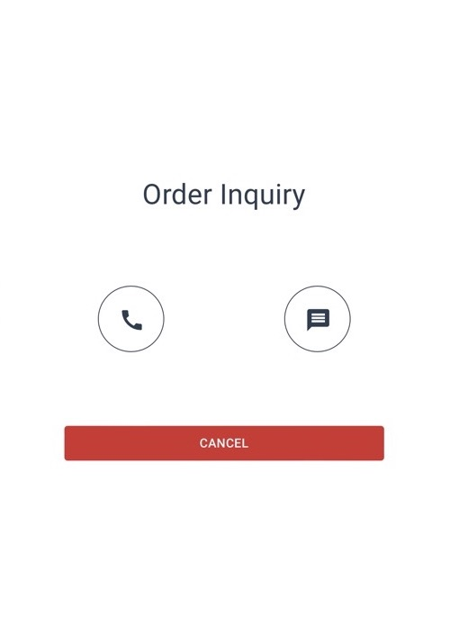


### **Voice Call**

Using [Whisper API](https://platform.openai.com/docs/guides/speech-to-text) to transcribe speech to text and [Web Speech API](https://developer.mozilla.org/en-US/docs/Web/API/Web_Speech_API) for text to speech operations.

Please note that you can only use voice call in `localhost` or using `https`.

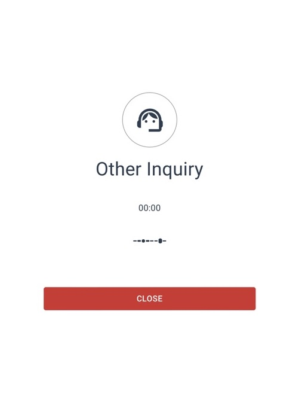

Currently, I set recording only after the message from the chatbot has finished being spoken by Speech API.
This is only for testing the feasibility of using ***real time*** voice call communication and limit using transcription API.
In actual situation, this restriction should be removed.

Voice recording begins only after it detected sound.
The minimum threshold is controlled by the variable [minDecibels](https://developer.mozilla.org/en-US/docs/Web/API/AnalyserNode/minDecibels). Please note that the value is in negative. I set loudest possible to -10dB, so set the value lower to prevent throwing exception. The default value is -60dB which makes it sensitive to background noise. Set it to -45dB to trigger recording only with audible speech.

Audio data recording will continue as long as sound is detected. When sound is not detected, the app will wait for 2500 ms before it sends the data to the backend. It is said that in human speech, the minimum interval for sentence is 2 seconds. You can control this by editing `maxPause` variable if you do not want to wait that long.


### **Chat Interface**

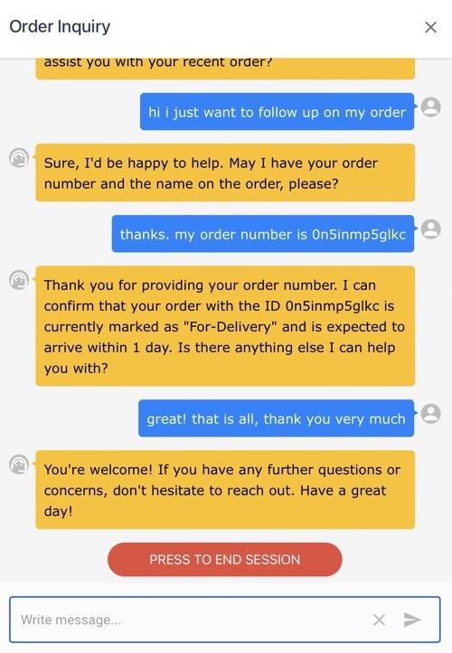

I added a function wherein I show a button to close session when the AI determined that the session has ended. However, the user can still continue to chat if they want. I made this just to show that automatically detecting when the session ends is possible. Of course, we can also add timer or message count to limit interaction. 


### **Customer Rating**

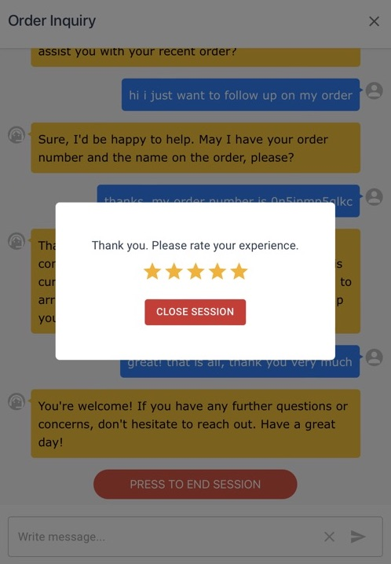

A rating interface for the user is shown when the session is closed.
This is used for later evaluation of the session.

For this demo, I only save the session data when you close the session.
But in normal operation, this should be done when the session starts.


## Using Japanese Language Setting

Customer Support in Japanese

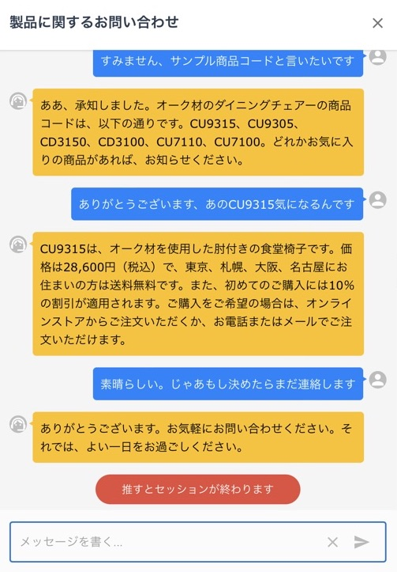

Session data including analysis written in Japanese

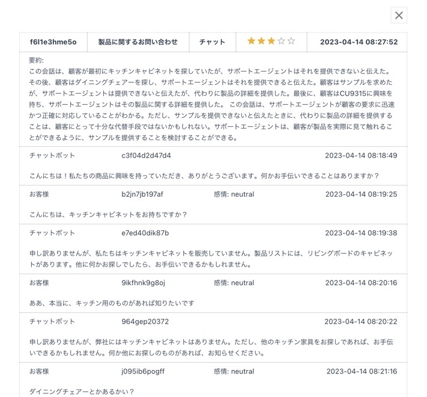


## How to Use Settings/Admin Page

You can access the Settings page by clicking the Settings icon in the landing page.


### **Data Source**

This is where you add the Data Source.
Check `/assets/product.txt` file for sample format.

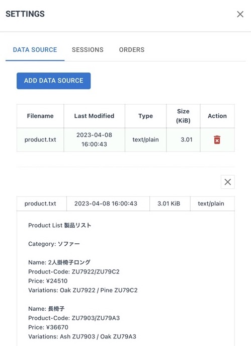


### **Sessions**
  
You can view all the saved sessions here.

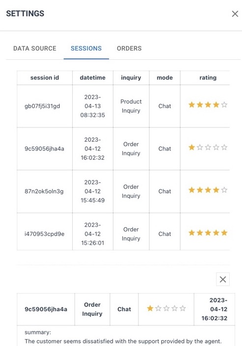

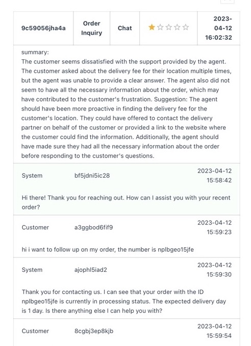


### **Orders**

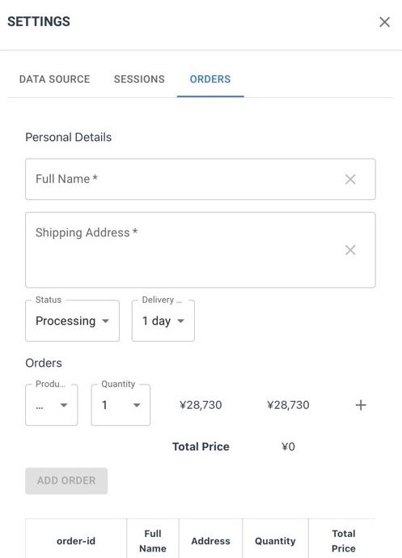

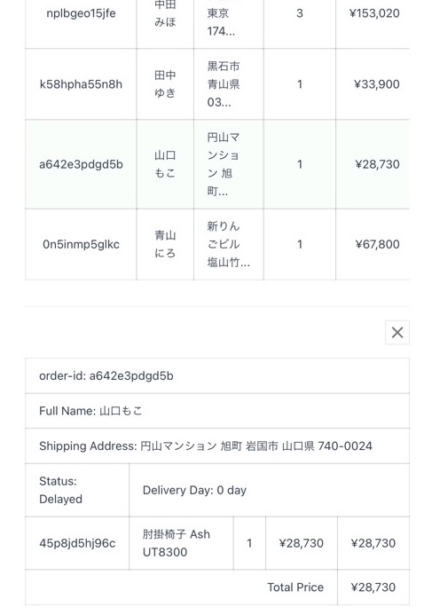

  This is where you add sample orders that you can use in the chat/voice support.
  Please note that this is very simple interface and is just used to demonstrate that we can fetch order data on the fly during the conversation.

# Using Local Files and ChatGPT

Basically, we will be using the embedding pattern:

```
[ Extract text data from files ]

[ Get embeddings for the text data for each file ]

[ Get embeddings for the user question ]

[ Compare the file embeddings with question embedding and get the result ]

[ Attach the result to prompt for ChatGPT ]
```


## Extracting Text Data from Files

In this project, I am only processing text files. To extract text data from text files in the backend:

```javascript
const form = await req.formData()
    
const blob = form.get('file')

const buffer = Buffer.from( await blob.arrayBuffer() )

const text = buffer.toString() // text data
```

You can easily find how to extract text data from other file types in the web.
It is not important for this demo so you need to do it yourself.

For example, for PDF files, install [pdf-parse](https://www.npmjs.com/package/pdf-parse):

```sh
npm install pdf-parse
```

Then in your backend

```javascript
import pdfParse from "pdf-parse"

...

const buffer = await new Promise((resolve, reject) => {
    const fileStream = fs.createReadStream(filepath);
    const chunks: any[] = []
    fileStream.on("data", (chunk) => {
      chunks.push(chunk);
    })
    fileStream.on("error", (error) => {
      reject(error);
    })
    fileStream.on("end", () => {
      resolve(Buffer.concat(chunks))
    })
})

const pdfData = await pdfParse(buffer)

return pdfData.text // text data
```

## Using Embeddings API

To get the embeddings from our text data

```javascript
const { Configuration, OpenAIApi } = require("openai")

const configuration = new Configuration({
  apiKey: process.env.OPENAI_API_KEY,
})

const openai = new OpenAIApi(configuration)

const response = await openai.createEmbedding({
  model: "text-embedding-ada-002",
  input: textData, // the text data we extracted from the files
})
```

Then we save the result in the database for later use.

We will also be getting the embeddings of the user's question itself.
Then using the file embeddings and the question embeddings, we compare it for similarity.

```javascript
const rankedChunks = fileEmbeddings.flatMap((file) =>
    file.chunks
    ? file.chunks.map((chunk) => {
        const dotProduct = chunk.embedding.reduce(
            (sum, val, i) => sum + val * questionEmbedding[i],
            0
        );
        return { ...chunk, filename: file.name, score: dotProduct };
    }) : []
    ).sort((a, b) => b.score - a.score).filter((chunk) => chunk.score > COSINE_SIM_THRESHOLD).slice(0, maxResults)
```

This code is basically just finding the [cosine similarity](https://en.wikipedia.org/wiki/Cosine_similarity).
The result of this is what we attach to the ChatGPT prompt.

## ChatGPT Prompt

Using the embeddings processing result, we will prepare our prompt for ChatGPT

```javascript
let system_prompt = `You are a helpful customer support agent.` +
    `Try to answer the question from the user using the content of the file extracts below, and if you cannot find the answer just say so.\n` +
    `If the answer is not contained in the files or if there are no file extracts, respond that you couldn't find the answer to that question.\n\n` +
    `Files:\n${rankedChunks}\n\n`
```

So from there it is just a matter of using the chat completion API:

```javascript
const { Configuration, OpenAIApi } = require("openai")

const configuration = new Configuration({
  apiKey: process.env.OPENAI_API_KEY,
})

const openai = new OpenAIApi(configuration)

const completion = await openai.createChatCompletion({
  model: "gpt-3.5-turbo",
  messages: [
    {role: "system", content: system_prompt},
    {role: "user", content: question}
],
})

console.log(completion.data.choices[0].message);
```

# API Endpoint

The embeddings pattern from above is only useful for a few files because of the limit in maximum tokens (e.g. 4096 tokens for gtp-3.5-turbo) that we can use in chat completion API.
It is immediately apparent that if we have large data source, we cannot use this.

For real customer support system, we will need database access for product and order information.

We can solve this by putting our data behind a server and providing API endpoints to fetch the data.
If you read the docs, this is basically what ChatGPT Plugin seem to be doing.

In this simulation, the product list, etc. are extracted from files. 
But for user's order, we will be using our backend database.

We add another step in our pattern above:

```
[user submits question]

[extract command from question]

[if command exist, use it to fetch data from API endpoint]

[add the result of API endpoint in ChatGPT]
```

## Function Calling

Today, [OpenAI updated the APIs](https://openai.com/blog/function-calling-and-other-api-updates) and among the update is the addition of `function calling capabilities`. This now makes the part `extracting command from question` as illustrated above simpler.

For example, before, to extract order number from the user inquiry:

```javascript
let command_prompt = `Check this inquiry if it contains order number/code.\n` + 
    `If it contains possible order number/code, convert this inquiry to a programmatic command:\n\n` +
    `Example:\n\n` +
    `Inquiry: The order number is 1234-5678-90\n` +
    `Output: find -order-no 1234-5678-90\n\n` +
    `If there is no order number/code:\n\n` +
    `Example:\n\n` +
    `Inquiry: Hello thank you\n` +
    `Output: NO-COMMAND\n\n` +
    `Inquiry: ` + question + `\n`

let output_str = await textCompletion({
    prompt: command_prompt,
    stop: ['Inquiry:'],
})
```

You need to prepare a good prompt and sample output.
But using the new `function calling`:

```javascript
const messages = [
    { role: "user", content: question }
]

const response_test = await chatCompletionFunc({
    model: 'gpt-3.5-turbo-0613',
    messages, 
    functions: [
        {
            name: "get_product_order",
            description: "Get the order details given the order number",
            parameters: {
                type: "object",
                properties: {
                    orderno: {
                        type: "string",
                        description: "The order number, e.g. abc12345, s9001-xaw9287-01"
                    }
                },
                required: ["orderno"]
            }
        }
    ]
})
```

You can easily see how much simpler and cleaner the code becomes.
The response will look like the following if the result comes with order number or not.

With order number

```javascript
{
  role: 'assistant',
  content: null,
  function_call: {
    name: 'get_product_order',
    arguments: '{\n"orderno": "cba345-027xy-5"\n}'
  }
}
```

Without order number

```javascript
{
  role: 'assistant',
  content: 'Hello Mark! How can I assist you today?'
}
```

# Whisper API

At present, you cannot use Safari for voice call function since the generated audio data is causing error for [Whisper API](https://platform.openai.com/docs/guides/speech-to-text).

Whisper API provides separate transcription and translation endpoints. For this app, we just need transcription. We only need to set the language instruction in ChatGPT if we use other than English.

To transcribe an audio data

```javascript
const { Configuration, OpenAIApi } = require("openai")

const configuration = new Configuration({
  apiKey: process.env.OPENAI_API_KEY,
})

const openai = new OpenAIApi(configuration)

const resp = await openai.createTranscription(
  fs.createReadStream("audio.mp3"),
  "whisper-1"
)
```

The [documentation](https://platform.openai.com/docs/api-reference/audio/create) list other parameters that we can use.

# Data Source

Before you can use the customer support function, you need to add a Data Source.

Currently, I only process text files although you can select other file types in the File dialog.
Although you can add any text file, to make this effective, you need to format it in such a way that information can easily be parsed.

Sample format:
```
Product List 製品リスト

Category: Sofa ソファー

Name: 2-seater Long Chair 2人掛椅子ロング
Product-Code: ABC0001 / ABC0002 / ABC0003
Price: ¥55000
Variations: Red ABC0001 / Black ABC0002 / White ABC0003
```

Check `/assets/product.txt` file for sample data source.


# Using MongoDB

I started this project with using just client side storage (e.g. localStorage and indexedDB) but as the development progresses it became clear that I need a database. For this purpose, I will be using MongoDB.

First, install [MongoDB Community Edition](https://www.mongodb.com/docs/manual/administration/install-community/). Then run the [MongoDB shell](https://www.mongodb.com/docs/mongodb-shell/) using command line

```
mongo
```

Then setup the database and test by inserting entry to a collection

```
use callcenter

db.orders.insertOne({id: 'abc123', name: 'John Doe'})

db.orders.find()
```

If that is successful, we now install the [MongoDB driver for Node.js](https://github.com/mongodb/node-mongodb-native).

In the project directory,

```
npm install mongodb
```

To connect to MongoDB in route handler

```js
import { MongoClient } from 'mongodb'
    
const client = new MongoClient(`mongodb://${process.env.DB_HOST}:${process.env.DB_PORT}/${process.env.DB_NAME}`)

export async function POST(request) {

  try {

    await client.connect()

    const db = client.db()
    const items = await db.collection('order').find().toArray()

    console.log(items)

  } catch(error) {
    console.log(error)
  } finally {
    await client.close()
  }

  ...
  
  return new Response(result, {
      status: 200,
  })

}
```

where the environmental variables from `.env`

```
DB_HOST=localhost
DB_USER=root
DB_PASS=
DB_NAME=callcenter
DB_PORT=27017
```

Edit the appropriate values according to your own MongoDB setup.


# Setup

Clone the repository and install the dependencies

```sh
git clone https://github.com/supershaneski/callcenter-simulator.git myproject

cd myproject

npm install
```

Copy `.env.example` and rename it to `.env` then edit the `OPENAI_APIKEY` and use your own `OpenAI API key`.

```javascript
OPENAI_APIKEY=YOUR_OWN_API_KEY
```

Prepare MongoDB and create the database.

Then update the variables for the database in the `.env` file.

```javascript
DB_HOST=localhost
DB_USER=root
DB_PASS=
DB_NAME=callcenter
DB_PORT=27017
```

Then run the app

```sh
npm run dev
```

Open your browser to `http://localhost:3005/` to load the application page.

Go to Settings->Data Source and load your text file.

Now, you can use the customer support functions.

